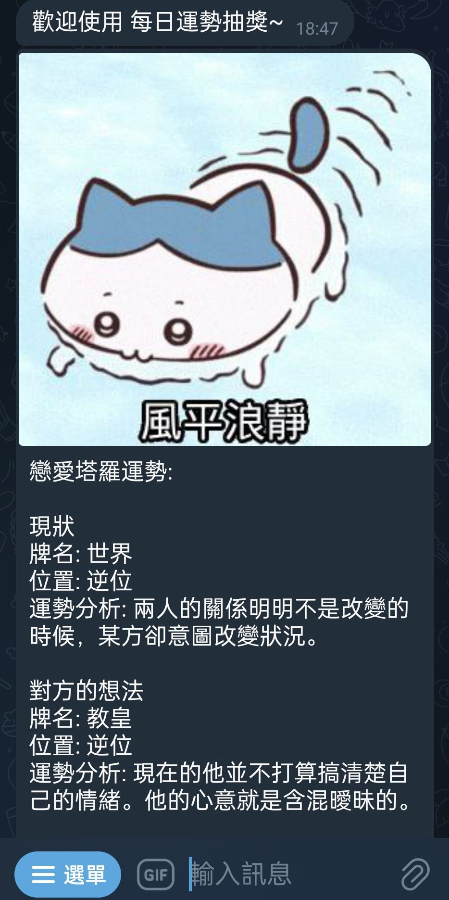
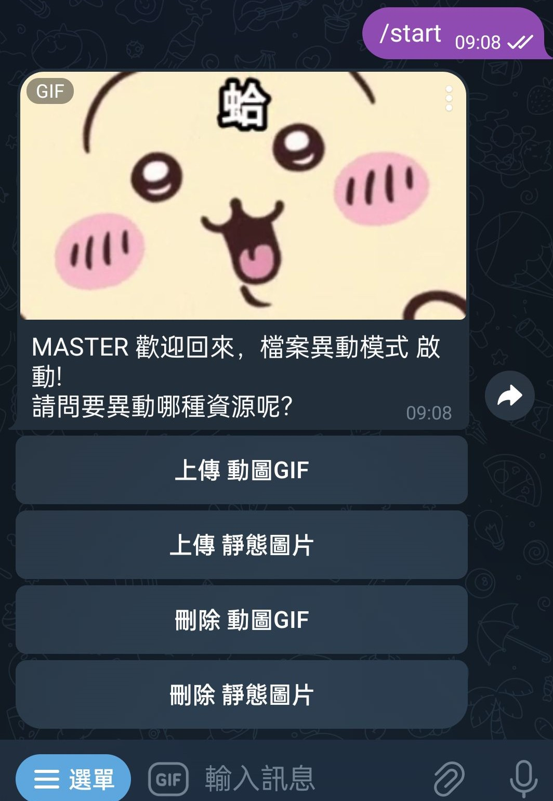

# 戀愛塔羅牌 Telegram BOT
## 專案環境

* 運行於GCP Debian環境
* 利用Docker守護進程
* 靜態圖片資源、Gif資源利用Telegram本身file_id屬性進行調用

## 專案使用工具

* 語言:JDK 17
* 框架:Spring Boot 3.1.5
* 版本控制:Git
* 依賴管理:Gradle
* 開發工具與插件:Intellij
* MySql 8 資料庫
* 快取工具:caffeine庫
* 透過flyway進行簡易SQL版控(若有SQL錯誤導致啟動失敗，仍需進去DB做回滾修復)

## 部屬時資料夾結構

## 本地開發環境建置流程
1. 安裝docker desktop
2. 運行docker-compose.dev-mysql.yml
3. 啟動java服務，flyway會自行建立資料庫結構(會有機器人註冊錯誤)   
4. 進入bot表填入機器人token
5. 重新運行java服務
6. 確定機器人可以進行/start對話  
7. 透過檔案管理機器人上傳靜態圖片與抽獎Gif
8. 完成啦，快算一下你的每日戀愛塔羅吧

## 雲端開發環境建置流程
1. 住幾想辦法，sh都給你參考啦~

## 機器人使用畫面
* 主機器人

* 檔案上傳機器人
